A) repoSchema
- Top level naming: main.html plus day1.html through day10.html.
- Each day file is a standalone HTML slide deck with the same document structure: <!DOCTYPE html>, <html>, <head>, inline 
    </head>
    <body>
    

     
     
     
     
     
     
     
     
    

    
    <!-- Slide 1: Welcome -->
    <section id="intro">
    <h1>Day 1</h1>
     <h2>Orientation &amp; The Circuit</h2>
     
Electronics is the study of controlling the flow of electrons.

     <ul>
     <li><strong>Voltage (V):</strong> Potential energy (The "Push")</li>
     <li><strong>Current (I):</strong> Flow rate (The "River")</li>
     <li><strong>Resistance (R):</strong> Restriction (The "Narrow Pipe")</li>
     </ul>
     
<strong>Why it matters:</strong> Every repair question eventually becomes: do we have the right push, the right path, and the right limit on flow?

     <ul>
     <li><strong>Misconception:</strong> Voltage alone is not dangerous to parts; uncontrolled current and heat are usually what destroy them.</li>
     <li><strong>Real-world example:</strong> A phone charger label lists voltage and current because the device must receive the correct electrical conditions.</li>
     <li><strong>Technician habit:</strong> When a circuit fails, start by asking, "Where is the source, where is the load, and where is ground?"</li>
     </ul>
     
Pro Tip: Electricity needs a complete path back to the source. The "path of least resistance" still must be a closed loop.

     
<strong>Question Hook:</strong> If voltage is the push and current is the flow, which one should we measure first when a circuit is completely dead?

    </section>
    
    <!-- Slide 2: Safety -->
    <section id="safety">
    <h2>Safety &amp; ESD</h2>
     

     DANGER: NEVER work on "Mains" power (Wall Outlets). 
     Static electricity (ESD) can destroy chips. Wear your wrist strap!
     

     

     

     
<strong>The Golden Rules:</strong>

     <ul>
     <li>Eye protection during lead clipping.</li>
     <li>Keep drinks away from your workstation.</li>
     <li>Check for "Magic Smoke" (Signs of overheating).</li>
     <li>De-energize before rewiring; do not move parts while the battery is connected.</li>
     <li>Use one hand when probing live low-voltage circuits to reduce accidental shorts.</li>
     </ul>
     

     

     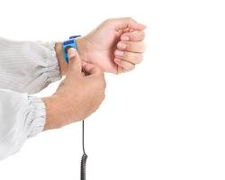
     
Proper ESD Protection

     

     

     
<strong>Fun Fact:</strong> A static spark can be thousands of volts, but the current is tiny; chips can still be damaged because their internal gates are microscopic.

     
<strong>Question Hook:</strong> Why can a small static shock be harmless to you but harmful to an integrated circuit?

    </section>
    
    <!-- Slide 3: Ohm's Law -->
    <section id="theory">
    <h2>The Math: Ohm's Law</h2>
     
V = I &times; R

     

     

     
<strong>Calculating Flow:</strong>

     <ul>
     <li>Increase Voltage = Increase Current</li>
     <li>Increase Resistance = Decrease Current</li>
     <li>Current is the result of voltage pushing through resistance, not a separate "supply knob" in a simple resistor circuit.</li>
     <li>Always convert milliamps to amps before calculating: 20 mA = 0.020 A.</li>
     </ul>
     
Example: If V=9V and R=470&Omega;, what is I?

     
<strong>Sanity Check:</strong> 9V / 470&Omega; is just under 0.02A, so the LED current should be about 19mA.

     

     

     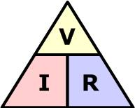
     

     

     
<strong>Question Hook:</strong> If the resistor doubles but the battery stays the same, what should happen to current?

    </section>
    
    <!-- Slide 4: The Components -->
    <section id="components">
    <h2>The Component Toolkit</h2>
     
Before we build, look at the physical parts in your kit:

     

     

     
<strong>Resistors:</strong> Look for the colored bands. They don't have a "side" - you can plug them in either way.

     
<strong>LEDs:</strong> Light Emitting Diodes. These ARE polarized. <small>Short Leg = Negative (-) | Long Leg = Positive (+)</small>

     <ul>
     <li><strong>Misconception:</strong> A resistor is not just "extra" - it is the current limiter that protects the LED.</li>
     <li><strong>Application:</strong> LED indicators on appliances use the same resistor-plus-LED idea.</li>
     </ul>
     

     

     
<strong>Jumper Wires:</strong> Think of these as your "Electron Highways." Keep them short and readable.

     
<strong>Breadboards:</strong> These allow us to prototype without permanent soldering.

     <ul>
     <li>Color-code power and ground when possible.</li>
     <li>Do not trust a connection until it is seated firmly.</li>
     </ul>
     

     

     
Talking Point: Why is the resistor needed for the LED? Hint: To stop the LED from turning into a tiny one-time flashlight.

    </section>
    
    <!-- Slide 5: DMM Basics -->
    <section id="dmm">
    <h2>Using the Multimeter (DMM)</h2>
     

     

     
<strong>The Three Big Settings:</strong>

     <ol>
     <li><strong>DC Voltage:</strong> Probing batteries and power.</li>
     <li><strong>Resistance (&Omega;):</strong> Checking component values.</li>
     <li><strong>Continuity (Beep):</strong> Checking for broken wires.</li>
     </ol>
     
&#9888;&#65039; Never check resistance on a live circuit!

     <ul>
     <li>Voltage measurements are usually the safest first check on a powered low-voltage circuit.</li>
     <li>Continuity is for unpowered circuits only.</li>
     </ul>
     

     

     

     <strong>How to measure:</strong> 
     - Voltage is measured in <strong>Parallel</strong>. 
     - Current is measured in <strong>Series</strong>. 
     - Resistance is measured with power <strong>OFF</strong>.
     

     
<strong>Sanity Check:</strong> If a 9V battery reads 0V, first verify the meter leads are in the correct jacks and the dial is on DC volts.

     

     

     
<strong>Question Hook:</strong> Why would putting a meter set to current directly across a battery be a bad idea?

    </section>
    
    <!-- Slide 6: New Slide - Preflight Check -->
    <section id="preflight">
    <h2>Build Preflight: Before Power</h2>
     

     

     
<strong>Use this checklist before connecting the battery:</strong>

     <ol>
     <li>Trace the positive path from source to resistor to LED.</li>
     <li>Trace the return path from LED back to battery negative.</li>
     <li>Confirm LED polarity: long leg toward the positive side.</li>
     <li>Check that no jumper wire directly connects + to -.</li>
     </ol>
     

     

     
<strong>Mini-Demo:</strong> Instructor shows one correct circuit and one circuit with a hidden open connection. Students predict which will light.

     
<strong>Rule of Thumb:</strong> If the circuit does nothing, suspect an open path first. If something gets hot, suspect a short or wrong resistor value.

     

     

     
<strong>Question Hook:</strong> What evidence would tell you the LED is backwards versus the breadboard row is disconnected?

    </section>
    
    <!-- Slide 7: Lab Activity -->
    <section id="lab">
    <h2>Lab 1: Your First Circuit</h2>
     

     

     
<strong>OBJECTIVE:</strong> Construct a simple DC circuit.

     <ol>
     <li>Power: 9V Battery</li>
     <li>Control: 470 Ohm Resistor</li>
     <li>Load: Standard LED</li>
     </ol>
     
<strong>Common Mistakes:</strong>

     <ul>
     <li>LED backwards (Long leg is Positive).</li>
     <li>Resistor not making contact in the breadboard.</li>
     <li>Using the same connected breadboard row for both LED legs, which bypasses the LED.</li>
     <li>Forgetting the return wire back to battery negative.</li>
     </ul>
     

     

     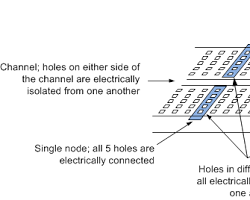
     
Horizontal rows are connected!

     

     

     
<strong>Question Hook:</strong> If the LED does not light, what is the first measurement you would take: battery voltage, resistor value, or LED polarity?

    </section>
    
    <!-- Slide 8: Recap -->
    <section id="recap">
    <h1>Wrap Up</h1>
     <h2>Day 1 Recap</h2>
     

     <ul>
     <li><strong>Safety First:</strong> We wear ESD straps and eye pro. No wall outlets!</li>
     <li><strong>The Big Three:</strong> Voltage pushes, Current flows, Resistance slows.</li>
     <li><strong>V = I x R:</strong> The most important math you'll ever use in this shop.</li>
     <li><strong>Tools:</strong> The Multimeter is your eyes. Use it to "see" electricity.</li>
     <li><strong>The Lab:</strong> You built a circuit! If it didn't light up, you learned how to troubleshoot.</li>
     <li><strong>Technician Habit:</strong> Predict first, power second, measure third.</li>
     </ul>
     

     
<strong>Exit Question:</strong> In one sentence, explain why an LED needs a resistor.

     
<strong>Tomorrow:</strong> Series vs. Parallel - Why Christmas lights used to be a nightmare.

    </section>
    
     <footer>
     
     
&copy; 2026 Mississippi Coding Academy / NEXTHANDS

     </footer>
    </body>
    </html>

- filePath: day2.html
  action: "modify"
  content: |
    <!DOCTYPE html>
    <html lang="en">
    <head>
     <meta charset="UTF-8">
     <meta name="viewport" content="width=device-width, initial-scale=1.0">
     <title>Day 2: Circuit Architectures</title>
     
    </head>
    <body>
    

     
     
     
     
     
     
     
     
    

    
    <!-- Slide 1: Welcome -->
    <section id="intro">
    <h1>Day 2</h1>
     <h2>Series vs. Parallel</h2>
     
Yesterday we built a single loop. Today, we learn how to branch out.

     <ul>
     <li><strong>Series:</strong> One path, shared current.</li>
     <li><strong>Parallel:</strong> Multiple paths, shared voltage.</li>
     <li><strong>Nodes:</strong> The "intersections" where paths meet.</li>
     <li><strong>Technician view:</strong> Series problems often look like opens; parallel problems often look like one failed branch.</li>
     </ul>
     
<strong>Real-world example:</strong> Home outlets are wired in parallel so a lamp, phone charger, and TV can all receive the same supply voltage independently.

     
Pro Tip: If one bulb goes out in series, they all go out. If one goes out in parallel, the rest stay on.

     
<strong>Question Hook:</strong> Which layout would you choose for room lights, and which layout would you choose for a single safety fuse?

    </section>
    
    <!-- Slide 2: Component Limits -->
    <section id="safety">
    <h2>Component Limits</h2>
     
DANGER: Exceeding Current (Amps) creates HEAT. 
     Every component has a wattage or current limit. Push too hard, and it fries.

     

     

     
<strong>Protecting the Gear:</strong>

     <ul>
     <li>Short circuits bypass the load and cause rapid overheating.</li>
     <li>Smell something funny? Disconnect the battery immediately.</li>
     <li>Check battery voltage before and after long labs.</li>
     <li>Use the resistor as the planned "traffic limit" for LED current.</li>
     </ul>
     

     

     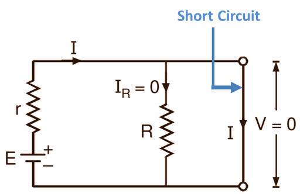
     
The Danger of a Short Circuit

     

     

     
<strong>Sanity Check:</strong> If a wire directly connects + to -, the circuit has almost no resistance and current can spike quickly.

     
<strong>Question Hook:</strong> Why does a short circuit usually get hot faster than a normal circuit?

    </section>
    
    <!-- Slide 3: The Chain -->
    <section id="series">
    <h2>The Chain: Series</h2>
     
Rt = R1 + R2 + ...

     

     

     
<strong>Cumulative Resistance:</strong>

     <ul>
     <li>Adding resistors in series increases total resistance.</li>
     <li>Current remains the same through all components.</li>
     <li>Voltage divides across loads based on their resistance.</li>
     <li>An open anywhere stops current everywhere.</li>
     </ul>
     
Example: Two 470&Omega; resistors in a line = 940&Omega; total.

     
<strong>Sanity Check:</strong> More series resistance means less current for the same battery.

     

     

     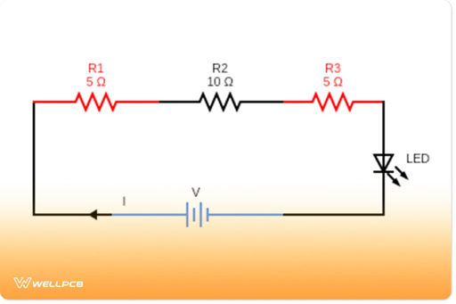
     

     

     
<strong>Question Hook:</strong> If two LEDs are in series and one is removed, why does the other go dark?

    </section>
    
    <!-- Slide 4: The Branches -->
    <section id="parallel">
    <h2>The Branches: Parallel</h2>
     
In parallel, each branch gets the full voltage of the source.

     

     

     
<strong>Independent Paths:</strong>

     
<strong>Voltage:</strong> Stays constant across all branches.

     
<strong>Current:</strong> Splits between the available paths.

     
<strong>The Trade-off:</strong> More branches in parallel decreases total resistance because there are more paths for electrons.

     

     

     <ul>
     <li><strong>Misconception:</strong> Adding more branches does not "use up" voltage; it increases total current demand.</li>
     <li><strong>Application:</strong> Power strips are parallel distribution points.</li>
     <li><strong>Joke:</strong> Parallel circuits share voltage better than most group projects share work.</li>
     </ul>
     

     

     
Talking Point: Why is your house wired in parallel? Hint: Do your lights die when the toaster is unplugged?

    </section>
    
    <!-- Slide 5: New Slide - Power Sharing -->
    <section id="power">
    <h2>Power Sharing &amp; Resistor Choices</h2>
     
P = V &times; I

     

     

     
<strong>Why power matters:</strong> Components fail when they must turn too much electrical energy into heat.

     <ul>
     <li>In series, one resistor may drop more voltage and dissipate more heat.</li>
     <li>In parallel, each branch needs its own current limit if each branch has an LED.</li>
     <li>Do not assume equal brightness unless the branch components are equal.</li>
     </ul>
     

     

     
<strong>Quick Estimate:</strong> A 20mA LED branch on 9V uses about 0.18W total. Choose resistor wattage with margin.

     
<strong>Rule of Thumb:</strong> If a resistor is too hot to comfortably touch, stop and recalculate current and power.

     

     

     
<strong>Question Hook:</strong> Why is "one resistor for four parallel LEDs" usually a bad repair habit?

    </section>
    
    <!-- Slide 6: Switches and Control -->
    <section id="switches">
    <h2>Switches &amp; Control</h2>
     
<strong>AND vs. OR Logic:</strong>

     <ol>
     <li><strong>AND (Series):</strong> Both switch A AND switch B must be closed for the light to turn on.</li>
     <li><strong>OR (Parallel):</strong> Either switch A OR switch B can be closed to complete the circuit.</li>
     </ol>
     
This is the foundation of computer logic.

     

     

     
<strong>Button Basics:</strong>

     <ul>
     <li><strong>Momentary:</strong> Only ON while pressed.</li>
     <li><strong>Toggle:</strong> Stays ON until flipped back.</li>
     <li><strong>Normally Open:</strong> Conducts only when pressed.</li>
     <li><strong>Normally Closed:</strong> Conducts until pressed.</li>
     </ul>
     

     

     
<strong>Real-world example:</strong> A machine may use two series safety switches so both guards must be closed before operation.

     
<strong>Sanity Check:</strong> When debugging a switch, measure continuity with power off before blaming the load.

     

     

     
<strong>Question Hook:</strong> Is a refrigerator door switch normally open or normally closed from the light's point of view?

    </section>
    
    <!-- Slide 7: Lab Activity -->
    <section id="lab">
    <h2>Lab 2: Branching Out</h2>
     

     

     
<strong>OBJECTIVE:</strong> Build and compare two LED configurations.

     <ol>
     <li>Setup A: Four LEDs in series with one resistor.</li>
     <li>Setup B: Four LEDs in parallel, each with their own resistor.</li>
     </ol>
     
<strong>Observations:</strong>

     <ul>
     <li>Which setup is dimmer? Why?</li>
     <li>Pull one LED out - what happens to the other?</li>
     <li>Measure supply voltage before and during the test.</li>
     <li>Sketch both circuits before building to catch node mistakes.</li>
     </ul>
     

     

     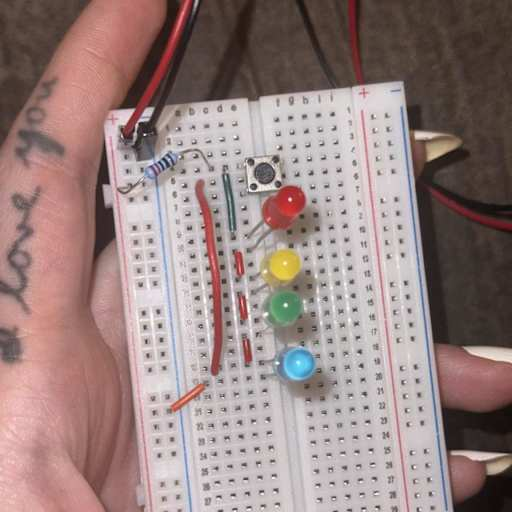
     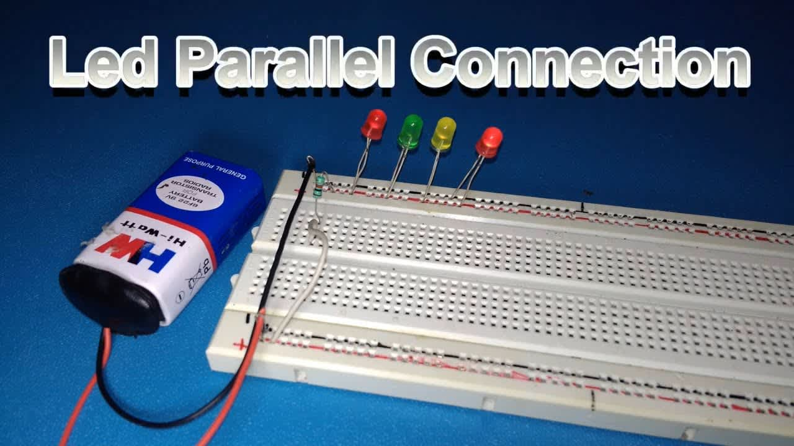
     
Notice how both parallel LEDs connect to the power rail.

     

     

     
<strong>Question Hook:</strong> Which circuit would be easier to troubleshoot if only one LED is dark?

    </section>
    
    <!-- Slide 8: Recap -->
    <section id="recap">
    <h1>Wrap Up</h1>
     <h2>Day 2 Recap</h2>
     

     <ul>
     <li><strong>Series:</strong> Components in a single file line. High resistance, low current.</li>
     <li><strong>Parallel:</strong> Components side-by-side. Shared voltage, independent paths.</li>
     <li><strong>Total Resistance:</strong> Increases in series; decreases in parallel.</li>
     <li><strong>The "Magic Smoke":</strong> Respect component limits to keep the hardware alive.</li>
     <li><strong>Logic:</strong> We used hardware to create simple AND/OR decisions.</li>
     <li><strong>Power:</strong> Heat is the evidence that energy is being dissipated.</li>
     </ul>
     

     
<strong>Exit Question:</strong> Why does total resistance decrease when you add a parallel branch?

     
<strong>Tomorrow:</strong> Capacitors &amp; Timing - Making circuits that can "remember" or blink on their own.

    </section>
    
     <footer>
     
     
&copy; 2026 Mississippi Coding Academy / NEXTHANDS

     </footer>
    </body>
    </html>

- filePath: day3.html
  action: "modify"
  content: |
    <!DOCTYPE html>
    <html lang="en">
    <head>
     <meta charset="UTF-8">
     <meta name="viewport" content="width=device-width, initial-scale=1.0">
     <title>Day 3: Multimeter Mastery & Troubleshooting</title>
     
    </head>
    <body>
    

     
     
     
     
     
     
     
     
    

    
    <!-- Slide 1: Welcome -->
    <section id="intro">
    <h1>Day 3</h1>
     <h2>DMM Mastery &amp; Troubleshooting</h2>
     
A technician is only as good as their ability to measure and interpret data.

     <ul>
     <li><strong>Verification:</strong> Confirming components meet specs.</li>
     <li><strong>Isolation:</strong> Pinpointing exactly where a circuit "breaks."</li>
     <li><strong>Validation:</strong> Ensuring a repair actually fixed the root cause.</li>
     <li><strong>Documentation:</strong> Writing down readings so the repair story can be defended.</li>
     </ul>
     
<strong>Real-world example:</strong> A repair shop will often require before-and-after measurements before approving a board as fixed.

     
Pro Tip: The Digital Multimeter (DMM) is not just a tool; it is your "eyes" inside the copper traces.

     
<strong>Question Hook:</strong> What is the difference between guessing a bad part and proving a bad part?

    </section>
    
    <!-- Slide 2: Probe Safety -->
    <section id="safety">
    <h2>Probe Safety &amp; Limits</h2>
     
WARNING: High current testing can blow your DMM's internal fuse. 
     Always start with the highest range setting if you are unsure of the signal level.

     

     

     
<strong>Safe Probing Habits:</strong>

     <ul>
     <li>Never touch the metal tips while the circuit is live.</li>
     <li>Keep probes sharp; dull tips slip and cause shorts.</li>
     <li>Verify your fuse before starting a complex repair.</li>
     <li>Anchor your black lead to ground when possible, then probe with red.</li>
     </ul>
     

     

     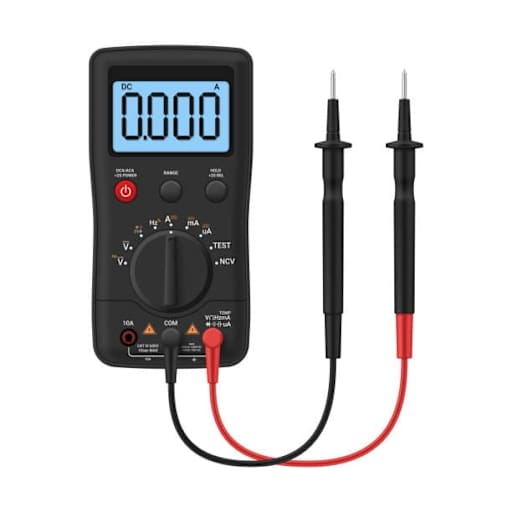
     
Finger Guards &amp; Lead Integrity

     

     

     
<strong>Sanity Check:</strong> If the meter reads nothing, check the dial, lead jacks, and ground clip before assuming the circuit is dead.

     
<strong>Question Hook:</strong> Why do many meters have a separate jack for current measurements?

    </section>
    
    <!-- Slide 3: Power Wheel -->
    <section id="power">
    <h2>The Math: The Power Wheel</h2>
     
P = V &times; I

     

     

     
<strong>Watt's Law in Action:</strong>

     <ul>
     <li>Power is measured in Watts (W).</li>
     <li>High Power = High Heat (The tech's biggest enemy).</li>
     <li>Power can reveal hidden overloads even when voltage looks normal.</li>
     <li>A resistor can have the correct ohms value but the wrong wattage rating.</li>
     </ul>
     
Example: If a circuit pulls 2A at 12V, how many Watts are used?

     

     

     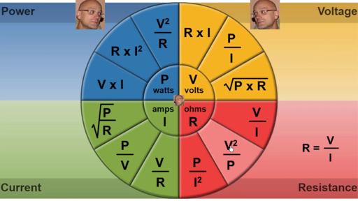
     

     

     
<strong>Sanity Check:</strong> 12V at 2A equals 24W; that is enough heat to demand component ratings and airflow.

     
<strong>Question Hook:</strong> Why might a component fail even if the voltage measurement looks correct?

    </section>
    
    <!-- Slide 4: Navigating the Dial -->
    <section id="dial">
    <h2>Navigating the Dial</h2>
     
Modern DMMs have specific modes for specialized testing:

     

     

     
<strong>Continuity (The Beep):</strong> Used for checking Opens (broken wires) and Shorts (accidental connections).

     
<strong>Diode Check:</strong> Measures the forward voltage drop, usually around 0.6V for silicon. If it beeps both ways, the diode is shorted.

     

     

     
<strong>Auto-Ranging:</strong> The meter finds the decimal point for you.

     
<strong>Hold Function:</strong> Freezes a reading when you cannot see the screen.

     
<strong>Common mistake:</strong> Seeing "OL" and thinking the meter is broken. It often means open circuit or over limit.

     

     

     
<strong>Meter Joke:</strong> Good technicians do not guess; they ask the meter to testify.

     
Talking Point: Why does the DMM show OL when the probes are not touching anything? Hint: Over Limit / Infinite Resistance.

    </section>
    
    <!-- Slide 5: Logical Troubleshooting -->
    <section id="logic">
    <h2>Logical Troubleshooting</h2>
     
<strong>The "Half-Split" Method:</strong>

     <ol>
     <li>Measure at the center of the signal path.</li>
     <li>Reading Good? The fault is in the second half.</li>
     <li>Reading Bad? The fault is in the first half.</li>
     </ol>
     
&#9888;&#65039; Always check your Ground reference first!

     

     

     
<strong>Measurement Rules:</strong>

     <ul>
     <li>Voltage: Probes across the component.</li>
     <li>Current: The DMM becomes part of the wire.</li>
     <li>Continuity: Power off, then listen for the path.</li>
     </ul>
     

     

     
<strong>Practical implication:</strong> Half-splitting prevents random part swapping. It turns a big unknown into two smaller questions.

     
<strong>Sanity Check:</strong> A voltage reading is meaningless unless you know what point you are using as reference.

     

     

     
<strong>Question Hook:</strong> If the input voltage is good and the output is bad, where should your next measurement be?

    </section>
    
    <!-- Slide 6: New Slide - Measurement Notes -->
    <section id="notes">
    <h2>Measurement Notes That Save Time</h2>
     

     

     
<strong>Write down four things for each reading:</strong>

     <ol>
     <li>Meter mode and range.</li>
     <li>Black probe location.</li>
     <li>Red probe location.</li>
     <li>Expected value vs. actual value.</li>
     </ol>
     

     

     
<strong>Mini-Drill:</strong> Measure the same resistor in two different breadboard locations and record whether the reading changes.

     
<strong>Real-world example:</strong> Repair tickets often fail when the tech writes "bad voltage" without saying where it was measured.

     
<strong>Rule of Thumb:</strong> A measurement without a reference point is only half a measurement.

     

     

     
<strong>Question Hook:</strong> Why is "5V measured at pin 14 to ground" better than writing only "5V"?

    </section>
    
    <!-- Slide 7: Lab Activity -->
    <section id="lab">
    <h2>Lab 3: Fault Finding Drills</h2>
     

     

     
<strong>OBJECTIVE:</strong> Identify three hidden faults on a pre-built board.

     <ol>
     <li>Check for Shorts to Ground.</li>
     <li>Verify Continuity across all switches.</li>
     <li>Measure Voltage Drop across the load.</li>
     <li>Record the expected reading before taking the actual reading.</li>
     </ol>
     
<strong>Troubleshooting Signs:</strong>

     <ul>
     <li>Discolored PCB = Overheating.</li>
     <li>Loose solder joints = Intermittent power.</li>
     <li>Voltage present on one side of a switch but not the other = open switch or bad joint.</li>
     </ul>
     

     

     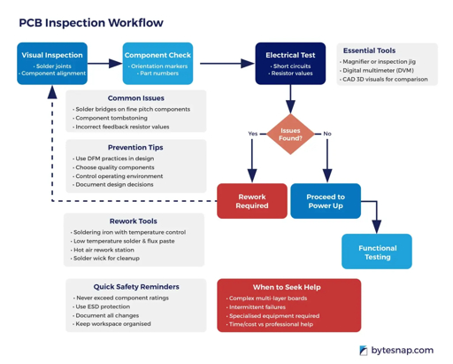
     
Follow the logic, not your gut.

     

     

     
<strong>Question Hook:</strong> Which fault is more likely: a component that randomly failed or a connection that was just touched?

    </section>
    
    <!-- Slide 8: Recap -->
    <section id="recap">
    <h1>Wrap Up</h1>
     <h2>Day 3 Recap</h2>
     

     <ul>
     <li><strong>Measurement:</strong> We used the DMM to see what our eyes cannot.</li>
     <li><strong>The Power Wheel:</strong> P = V x I. Power kills components through heat.</li>
     <li><strong>Continuity:</strong> Our most used tool for finding broken traces.</li>
     <li><strong>Strategy:</strong> Using the Half-Split method to save time.</li>
     <li><strong>The Lab:</strong> You moved from building to fixing.</li>
     <li><strong>Documentation:</strong> Good notes turn a repair into evidence.</li>
     </ul>
     

     
<strong>Exit Question:</strong> What does OL mean in continuity mode, and why is that useful?

     
<strong>Tomorrow:</strong> Diodes &amp; Power - How we tame electricity to go in only one direction.

    </section>
    
     <footer>
     
     
&copy; 2026 Mississippi Coding Academy / NEXTHANDS

     </footer>
    </body>
    </html>

- filePath: day4.html
  action: "modify"
  content: |
    <!DOCTYPE html>
    <html lang="en">
    <head>
     <meta charset="UTF-8">
     <meta name="viewport" content="width=device-width, initial-scale=1.0">
     <title>Day 4: Diodes & Power Supplies</title>
     
    </head>
    <body>
    

     
     
     
     
     
     
     
     
    

    
    <!-- Slide 1: Welcome -->
    <section id="intro">
    <h1>Day 4</h1>
     <h2>Diodes &amp; Power Supplies</h2>
     
Until now, we have dealt with current that flows easily. Today, we learn how to control its direction.

     <ul>
     <li><strong>Semiconductors:</strong> Materials that only conduct under specific conditions.</li>
     <li><strong>AC vs DC:</strong> Converting "Wall Power" (Alternating) to "Battery Power" (Direct).</li>
     <li><strong>The Check Valve:</strong> Diodes allow current in one direction only.</li>
     <li><strong>Repair connection:</strong> Many dead devices fail at the power input before the main circuit even starts.</li>
     </ul>
     
<strong>Real-world example:</strong> Reverse-polarity protection diodes help protect devices when the wrong adapter is plugged in.

     
Pro Tip: Without diodes, your phone charger would not safely convert AC into the DC your battery needs.

     
<strong>Question Hook:</strong> Why would a one-way electrical part be useful in a power supply?

    </section>
    
    <!-- Slide 2: The Semiconductor -->
    <section id="semiconductor">
    <h2>The Semi-Conductor</h2>
     
POLARITY MATTERS: Diodes are directional. 
     The silver stripe marks the Cathode (-). The other side is the Anode (+).

     

     

     
<strong>Bias States:</strong>

     <ul>
     <li><strong>Forward Bias:</strong> Current flows (Switch is ON).</li>
     <li><strong>Reverse Bias:</strong> Current is blocked (Switch is OFF).</li>
     <li><strong>Voltage Drop:</strong> Most silicon diodes "steal" about 0.7V.</li>
     <li><strong>Misconception:</strong> A diode is not a perfect wire when ON; it has a voltage drop and a current limit.</li>
     </ul>
     

     

     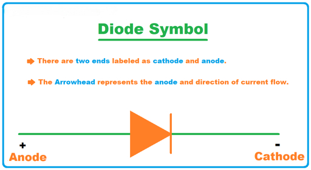
     
Silver Stripe = Negative (Cathode)

     

     

     
<strong>Sanity Check:</strong> In diode test mode, one direction should show a voltage drop and the other should show OL.

     
<strong>Question Hook:</strong> If a diode reads 0.000V in both directions, what failure mode does that suggest?

    </section>
    
    <!-- Slide 3: Why We Need Them -->
    <section id="rectify">
    <h2>Why do we need them?</h2>
     
AC &rarr; Diode &rarr; DC

     

     

     
<strong>Rectification:</strong>

     
The process of converting Alternating Current, which flips back and forth, into Direct Current, which flows one way.

     <ul>
     <li>Devices like the 1N4001 are the workhorses of small power supplies.</li>
     <li>The output is not perfectly smooth yet; it still pulses.</li>
     <li>Capacitors often come next to smooth the ripple.</li>
     </ul>
     

     

     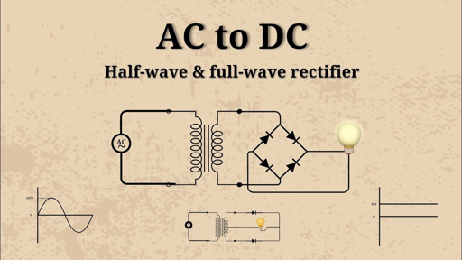
     

     

     
<strong>Question Hook:</strong> Why is rectified DC still not as smooth as battery DC?

    </section>
    
    <!-- Slide 4: Rectification Types -->
    <section id="types">
    <h2>Rectification Types</h2>
     

     

     
<strong>Half-Wave:</strong>

     
Uses 1 diode. It cuts off the bottom half of the AC wave. It works, but it is bumpy and inefficient.

     <ul>
     <li>Simple and cheap.</li>
     <li>Large gaps between pulses.</li>
     </ul>
     

     

     
<strong>Full-Wave:</strong>

     
Uses multiple diodes to flip the negative half of the wave into positive. This provides much smoother power.

     <ul>
     <li>Better use of the AC waveform.</li>
     <li>More parts, but better output quality.</li>
     </ul>
     

     

     
Talking Point: Think of a Half-Wave rectifier like hopping on one leg. Full-Wave is like walking with both.

     
<strong>Question Hook:</strong> Which rectifier type would make a filter capacitor's job easier, and why?

    </section>
    
    <!-- Slide 5: Bridge Rectifier -->
    <section id="bridge">
    <h2>The Bridge Rectifier</h2>
     
This is the standard layout for almost every DC power brick on earth.

     

     

     
<strong>The Diamond Pattern:</strong>

     <ol>
     <li>Four diodes arranged to steer current.</li>
     <li>No matter which way the AC comes in, the DC always leaves the same way.</li>
     <li>Two diodes conduct at a time, so expect roughly two diode drops in the path.</li>
     </ol>
     
<strong>Diagnostic Check:</strong> - Use the Diode Test mode on your DMM. - You should see about 0.6V one way and OL the other way.

     

     

     
<strong>Sanity Check:</strong> If the output polarity flips with the AC input, the bridge is wired incorrectly.

     
<strong>Real-world example:</strong> Many laptop adapters and phone chargers begin with rectification before voltage regulation.

     

     

     
<strong>Question Hook:</strong> Why does a bridge rectifier need four diodes instead of one?

    </section>
    
    <!-- Slide 6: New Slide - Diode Failure Modes -->
    <section id="failures">
    <h2>Diode Failure Modes</h2>
     

     

     
<strong>Common failures:</strong>

     <ul>
     <li><strong>Open diode:</strong> Blocks both directions; circuit acts dead past that point.</li>
     <li><strong>Shorted diode:</strong> Conducts both directions; may blow fuses or overheat.</li>
     <li><strong>Leaky diode:</strong> Partly conducts in reverse; can cause weird, intermittent behavior.</li>
     </ul>
     

     

     
<strong>Demo Prep:</strong> Compare a known-good diode and a failed/shorted sample using diode test mode.

     
<strong>Rule of Thumb:</strong> Test out of circuit when readings do not make sense; nearby parts can create alternate paths.

     
<strong>Diode Joke:</strong> Diodes are one-way streets; ignore the sign and traffic gets confusing fast.

     

     

     
<strong>Question Hook:</strong> Which failure would cause a fuse to blow faster: an open diode or a shorted diode?

    </section>
    
    <!-- Slide 7: Lab Activity -->
    <section id="lab">
    <h2>Lab 4: Building a Rectifier</h2>
     

     

     
<strong>OBJECTIVE:</strong> Build a Half-Wave and Full-Wave rectifier circuit.

     <ol>
     <li>Use an AC signal generator (low voltage!).</li>
     <li>Construct the circuit using 1N4001 diodes.</li>
     <li>Measure the Output Voltage with your DMM.</li>
     <li>Use diode mode to verify each diode before building.</li>
     </ol>
     
<strong>Common Mistakes:</strong>

     <ul>
     <li>Diode facing the wrong way (stripe is key).</li>
     <li>Measuring AC setting on a DC output.</li>
     <li>Forgetting that bridge output has a + and - even though the input is AC.</li>
     </ul>
     

     

     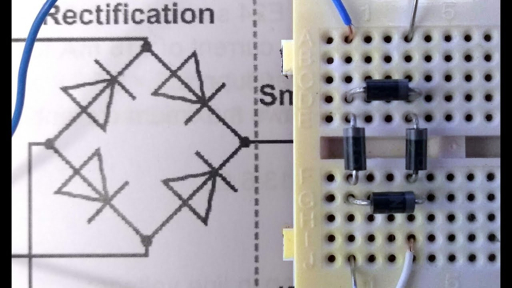
     
Follow the diamond pattern.

     

     

     
<strong>Question Hook:</strong> What should the meter show if you accidentally reverse one diode in the bridge?

    </section>
    
    <!-- Slide 8: Recap -->
    <section id="recap">
    <h1>Wrap Up</h1>
     <h2>Day 4 Recap</h2>
     

     <ul>
     <li><strong>Diodes:</strong> Electronic one-way valves.</li>
     <li><strong>Anode/Cathode:</strong> Current enters the Anode (+) and leaves the Cathode (-).</li>
     <li><strong>Rectification:</strong> Turning messy AC into usable DC.</li>
     <li><strong>Bridge Rectifiers:</strong> The 4-diode team that powers our digital world.</li>
     <li><strong>Measurement:</strong> We use the DMM Diode mode to verify if a diode is blown.</li>
     <li><strong>Failure Modes:</strong> Open, shorted, and leaky diodes tell different troubleshooting stories.</li>
     </ul>
     

     
<strong>Exit Question:</strong> What is the difference between a diode being reverse-biased and a diode being open?

     
<strong>Tomorrow:</strong> Capacitors &amp; Timing - How to smooth out bumpy DC and create delays.

    </section>
    
     <footer>
     
     
&copy; 2026 Mississippi Coding Academy / NEXTHANDS

     </footer>
    </body>
    </html>

- filePath: day5.html
  action: "modify"
  content: |
    <!DOCTYPE html>
    <html lang="en">
    <head>
     <meta charset="UTF-8">
     <meta name="viewport" content="width=device-width, initial-scale=1.0">
     <title>Day 5: Capacitors & RC Timing</title>
     
    </head>
    <body>
    

     
     
     
     
     
     
     
     
    

    
    <!-- Slide 1: Welcome -->
    <section id="intro">
    <h1>Day 5</h1>
     <h2>Capacitors &amp; RC Timing</h2>
     
Yesterday we steered electricity. Today we learn how to store it and use it to create timing.

     <ul>
     <li><strong>Temporary Batteries:</strong> Capacitors store energy in an electric field.</li>
     <li><strong>Filtering:</strong> Turning bumpy DC into smooth power.</li>
     <li><strong>The Time Constant:</strong> Using resistors and capacitors to control speed.</li>
     <li><strong>Repair connection:</strong> Capacitor condition often decides whether a power supply is stable or noisy.</li>
     </ul>
     
<strong>Real-world example:</strong> A camera flash charges a capacitor and then releases the stored energy quickly.

     
Pro Tip: Capacitors are like water tanks; they can fill slowly and dump energy quickly.

     
<strong>Question Hook:</strong> Why would a circuit designer want a part that delays voltage changes?

    </section>
    
    <!-- Slide 2: The Capacitor -->
    <section id="capacitor">
    <h2>The Capacitor (C)</h2>
     
DANGER: Capacitors can hold a charge even when the power is OFF. 
     Always discharge large capacitors before touching a circuit. They can bite.

     

     

     
<strong>Key Concepts:</strong>

     <ul>
     <li><strong>Farads (F):</strong> The unit of capacitance, usually uF or nF in electronics.</li>
     <li><strong>Voltage Rating:</strong> The maximum pressure the cap can handle before it fails.</li>
     <li><strong>Electrolytic:</strong> These are polarized (+ and -). Backward installation can pop them.</li>
     <li><strong>Misconception:</strong> Higher capacitance is not always better; it can change timing and startup behavior.</li>
     </ul>
     

     

     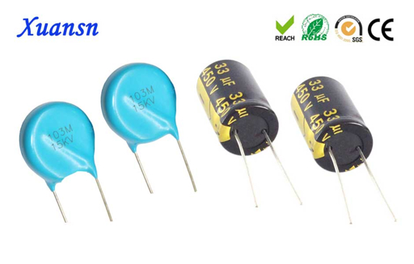
     
Electrolytic (Can) vs Ceramic (Disc)

     

     

     
<strong>Sanity Check:</strong> Replacement capacitor voltage rating may be higher than original, but never lower.

     
<strong>Question Hook:</strong> Why does polarity matter for electrolytic capacitors but not most ceramic capacitors?

    </section>
    
    <!-- Slide 3: RC Time Constant -->
    <section id="rc">
    <h2>The RC Time Constant</h2>
     
&tau; = R &times; C

     

     

     
<strong>How it works:</strong>

     
A Resistor limits how fast a Capacitor can fill up. This creates a predictable delay.

     <ul>
     <li>High Resistance = Slower charge.</li>
     <li>High Capacitance = Slower charge.</li>
     <li>5 Tau Rule: It takes roughly 5 time constants to fully charge/discharge.</li>
     <li>The voltage changes quickly at first, then slows as it approaches the final value.</li>
     </ul>
     

     

     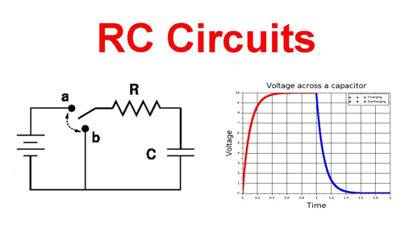
     

     

     
<strong>Sanity Check:</strong> 10k&Omega; x 100uF = about 1 second per tau, so near-full charge takes around 5 seconds.

     
<strong>Question Hook:</strong> Which change would make the LED fade longer: bigger resistor, bigger capacitor, or both?

    </section>
    
    <!-- Slide 4: Inductors -->
    <section id="inductor">
    <h2>Inductors (L)</h2>
     
The mirror image of a capacitor. While caps store energy in an Electric Field, Inductors store it in a Magnetic Field.

     

     

     
<strong>Characteristics:</strong>

     <ul>
     <li>Measured in Henries (H).</li>
     <li>They resist sudden changes in Current.</li>
     <li>Commonly used in filters and power conversion.</li>
     <li>They can create voltage spikes when current is interrupted suddenly.</li>
     </ul>
     

     

     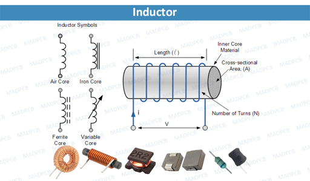
     
Simple coils of wire create magnetism.

     

     

     
<strong>Question Hook:</strong> Why might a relay coil need a diode across it when it turns off?

    </section>
    
    <!-- Slide 5: Repair Skills -->
    <section id="repair">
    <h2>Repair Skills: Inspecting Failed Caps</h2>
     
Capacitors are a common cause of failure in modern electronics.

     

     

     
<strong>Visual Red Flags:</strong>

     <ul>
     <li><strong>Bulging:</strong> The top X or K vent is puffed up.</li>
     <li><strong>Leaking:</strong> Crusty brown/white fluid at the base.</li>
     <li><strong>Heat:</strong> Discoloration on the PCB around the cap.</li>
     <li><strong>Shrunken sleeve:</strong> Plastic sleeve pulled back from heat exposure.</li>
     </ul>
     

     

     
<strong>Troubleshooting Step:</strong> Use your DMM in Capacitance Mode to see if the value matches the label. If a 1000uF cap reads 200uF, it is dead.

     
<strong>Real-world example:</strong> Old LCD monitors often fail to power on because dried-out power-supply capacitors create ripple and weak startup voltage.

     
<strong>Capacitor Joke:</strong> Capacitors do not forget instantly; they fade out gracefully.

     

     

     
<strong>Question Hook:</strong> Why should you inspect capacitors visually before reaching for the meter?

    </section>
    
    <!-- Slide 6: New Slide - RC Design Estimates -->
    <section id="estimate">
    <h2>RC Design Quick Estimates</h2>
     

     

     
<strong>Fast design math:</strong>

     <ul>
     <li>Pick the time you want.</li>
     <li>Choose a capacitor size that is practical.</li>
     <li>Solve for the resistor that gets close.</li>
     <li>Build, measure, then adjust because real parts have tolerance.</li>
     </ul>
     

     

     
<strong>Mini-Demo:</strong> Compare 100uF and 470uF using the same resistor. Students predict which LED fades longer before testing.

     
<strong>Rule of Thumb:</strong> Electrolytic capacitors can vary a lot from their printed value, so timing circuits need testing, not just math.

     

     

     
<strong>Question Hook:</strong> If your fade is too short, would you change R, C, or both? What trade-off comes with each?

    </section>
    
    <!-- Slide 7: Lab Activity -->
    <section id="lab">
    <h2>Lab 5: The LED Fade-Off</h2>
     

     

     
<strong>OBJECTIVE:</strong> Build an RC circuit that keeps an LED lit after the button is released.

     <ol>
     <li>Place a large Electrolytic Cap (470uF+) in parallel with an LED circuit.</li>
     <li>Press the button to charge the tank.</li>
     <li>Release the button and observe the fade out.</li>
     <li>Measure voltage across the capacitor every second for five seconds.</li>
     </ol>
     
<strong>The Challenge:</strong> Swap the resistor for a higher value. Does the LED stay on longer or shorter? Why?

     

     

     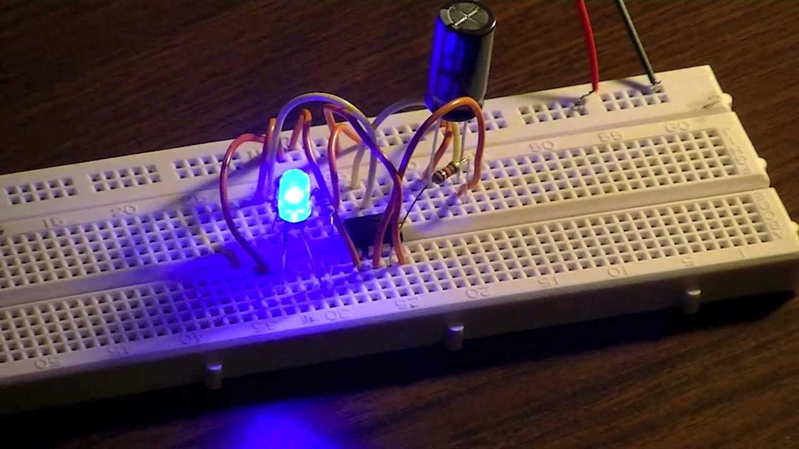
     

     

     
<strong>Question Hook:</strong> Why does the LED fade instead of turning off instantly?

    </section>
    
    <!-- Slide 8: Week 1 Complete -->
    <section id="recap">
    <h1>Week 1 Complete</h1>
     <h2>Fundamentals Mastered</h2>
     

     <ul>
     <li><strong>Safety:</strong> You know how to respect the bench.</li>
     <li><strong>Ohm's Law:</strong> You can calculate the Big Three (V, I, R).</li>
     <li><strong>DMM:</strong> You can measure continuity, voltage, and components.</li>
     <li><strong>Diodes/Caps:</strong> You understand direction and storage.</li>
     <li><strong>Timing:</strong> You can predict and adjust simple RC behavior.</li>
     </ul>
     

     
<strong>Exit Question:</strong> What does one time constant tell you about an RC circuit?

     
<strong>Next Week:</strong> We move to Active Devices - starting with Transistors, the building blocks of all modern computing.

    </section>
    
     <footer>
     
     
&copy; 2026 Mississippi Coding Academy / NEXTHANDS

     </footer>
    </body>
    </html>

- filePath: day6.html
  action: "modify"
  content: |
    <!DOCTYPE html>
    <html lang="en">
    <head>
     <meta charset="UTF-8">
     <meta name="viewport" content="width=device-width, initial-scale=1.0">
     <title>Day 6: Transistors as Switches</title>
     
    </head>
    <body>
    

     
     
     
     
     
     
     
    

    
    <!-- Slide 1: Welcome -->
    <section id="intro">
    <h1>Day 6</h1>
     <h2>The BJT: Electronic Switching</h2>
     
A Bipolar Junction Transistor (BJT) is a "faucet" for electricity.

     <ul>
     <li><strong>Base (B):</strong> The Handle. Small current here controls a large current elsewhere.</li>
     <li><strong>Collector (C):</strong> The Inlet. Where the main current comes from.</li>
     <li><strong>Emitter (E):</strong> The Outlet. Where the current goes to.</li>
     <li><strong>Repair view:</strong> A transistor often sits between a low-power control signal and a higher-power load.</li>
     </ul>
     
<strong>Real-world example:</strong> A microcontroller pin cannot drive a motor directly, so it uses a transistor to switch motor current.

     
Pro Tip: Mechanical switches need a finger; transistors allow a circuit to flip its own switches.

     
<strong>Question Hook:</strong> Why might a tiny control signal need help turning on a larger load?

    </section>
    
    <!-- Slide 2: Cutoff vs Saturation -->
    <section id="states">
    <h2>The Two States: Cutoff vs. Saturation</h2>
     

     

     
<strong>Cutoff (OFF):</strong>

     <ul>
     <li>No current to the Base.</li>
     <li>Collector to Emitter is an Open Circuit.</li>
     <li>Load should be OFF except for leakage or wiring mistakes.</li>
     </ul>
     
<strong>Saturation (ON):</strong>

     <ul>
     <li>Sufficient current to the Base.</li>
     <li>Collector to Emitter acts like a Closed Wire.</li>
     <li>Best state for switching because heat is lower than halfway-on operation.</li>
     </ul>
     

     

     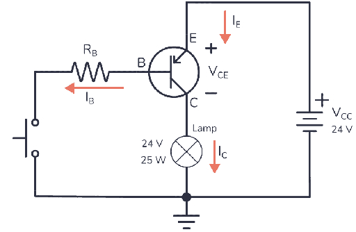
     
NPN Transistor as a Switch

     

     

     
<strong>Sanity Check:</strong> For a low-side NPN switch, emitter goes to ground and the load is usually above the collector.

     
<strong>Question Hook:</strong> Why can a transistor get hot when it is only halfway on?

    </section>
    
    <!-- Slide 3: DC Current Gain -->
    <section id="gain">
    <h2>The Math: DC Current Gain</h2>
     
&beta; (hFE) = Ic / Ib

     

     

     
<strong>Amplification Power:</strong>

     <ul>
     <li><strong>Ib:</strong> Base Current (Small control signal)</li>
     <li><strong>Ic:</strong> Collector Current (Large load signal)</li>
     <li>If a transistor has a Gain (&beta;) of 100, 1mA at the base can control 100mA at the collector.</li>
     <li>For switching, design for saturation instead of trusting the best-case gain.</li>
     </ul>
     

     

     
<strong>Check the Datasheet:</strong> Every transistor has a different gain limit. Look for the hFE value.

     
<strong>Sanity Check:</strong> If the load needs 100mA, do not provide only a tiny base current and hope; give the base enough margin through a resistor.

     

     

     
<strong>Question Hook:</strong> Why is datasheet gain a range instead of one exact number?

    </section>
    
    <!-- Slide 4: 2N2222 Pinout -->
    <section id="pinout">
    <h2>The 2N2222 Pinout</h2>
     
BJTs look identical from the outside. You MUST know the pinout.

     

     

     
<strong>NPN vs PNP:</strong>

     <ul>
     <li><strong>NPN:</strong> Switched with a POSITIVE voltage (Most common).</li>
     <li><strong>PNP:</strong> Switched with a NEGATIVE (Ground) voltage.</li>
     <li>Look for the flat side of the TO-92 package to identify pins 1, 2, and 3.</li>
     <li>Do not assume every transistor package uses the same order.</li>
     </ul>
     
<strong>Sanity Check:</strong> Wrong pinout can make a correct schematic behave like a dead circuit.

     

     

     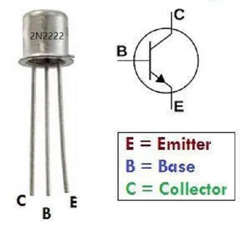
     
Flat face facing you: E - B - C

     

     

     
<strong>Question Hook:</strong> What symptoms might you see if collector and emitter are swapped?

    </section>
    
    <!-- Slide 5: New Slide - Base Resistor -->
    <section id="base-resistor">
    <h2>Choosing a Base Resistor</h2>
     

     

     
<strong>Why it exists:</strong> The base-emitter junction behaves like a diode. Without a resistor, base current can be too high.

     <ul>
     <li>The base resistor protects the control source.</li>
     <li>It also controls how strongly the transistor is driven ON.</li>
     <li>Too large: transistor may not saturate.</li>
     <li>Too small: control pin or transistor may overheat.</li>
     </ul>
     

     

     
<strong>Quick Estimate:</strong> If the control signal is 5V and base-emitter drop is about 0.7V, a 10k resistor gives about 0.43mA base current.

     
<strong>Rule of Thumb:</strong> Use a base resistor every time a BJT base connects to a voltage source or logic pin.

     
<strong>Transistor Joke:</strong> A transistor is a tiny bouncer; a small signal at the base decides whether the load gets in.

     

     

     
<strong>Question Hook:</strong> What could happen if you connect the base directly to 9V with no resistor?

    </section>
    
    <!-- Slide 6: Lab Activity -->
    <section id="lab">
    <h2>Lab 6: The Transistor Switch</h2>
     

     

     
<strong>OBJECTIVE:</strong> Use a low-power touch to light a high-power LED.

     <ol>
     <li>Insert 2N2222 NPN Transistor.</li>
     <li>Connect Load (LED + Resistor) to the Collector.</li>
     <li>Connect Emitter to Ground.</li>
     <li>Touch the Base through a 10k resistor to 9V.</li>
     <li>Measure base voltage and collector voltage in OFF and ON states.</li>
     </ol>
     
<strong>Challenge:</strong> Can you make the LED light up just by touching the wire with your finger? Using your body's resistance as the Base trigger.

     

     

     
WARNING: Transistors get HOT if they are in the Linear Region (half-way on). Ensure you are fully saturating the base.

     
<strong>Common mistakes:</strong> reversed E-B-C pins, missing LED resistor, and forgetting common ground.

     

     

     
<strong>Question Hook:</strong> How can measuring collector voltage tell you whether the transistor is saturated?

    </section>
    
    <!-- Slide 7: Recap -->
    <section id="recap">
    <h1>Wrap Up</h1>
     <h2>Day 6 Recap</h2>
     

     <ul>
     <li><strong>Solid State:</strong> No moving parts, unlike a mechanical relay.</li>
     <li><strong>Current Gain:</strong> A tiny Input controls a larger Output.</li>
     <li><strong>The Faucet:</strong> Base is the handle, Collector is the supply, Emitter is the drain.</li>
     <li><strong>Saturation:</strong> For switching, we want the transistor Wide Open.</li>
     <li><strong>Base Resistor:</strong> Protects the control signal and controls drive current.</li>
     </ul>
     

     
<strong>Exit Question:</strong> Why is "halfway on" a bad state for a transistor used as a switch?

     
<strong>Tomorrow:</strong> Digital Logic - How millions of these transistors work together to Think.

    </section>
    
     <footer>
     
     
&copy; 2026 Mississippi Coding Academy / NEXTHANDS

     </footer>
    </body>
    </html>

- filePath: day7.html
  action: "modify"
  content: |
    <!DOCTYPE html>
    <html lang="en">
    <head>
     <meta charset="UTF-8">
     <meta name="viewport" content="width=device-width, initial-scale=1.0">
     <title>Day 7: Digital Logic & Gates</title>
     
    </head>
    <body>
    

     
     
     
     
     
     
     
    

    
    <!-- Slide 1: Welcome -->
    <section id="intro">
    <h1>Day 7</h1>
     <h2>Digital Logic &amp; Gateways</h2>
     
Everything in modern computing boils down to two states: 1 (High/ON) and 0 (Low/OFF).

     <ul>
     <li><strong>Binary:</strong> Base-2 numbering system.</li>
     <li><strong>Logic Level:</strong> Usually 5V or 3.3V represents High.</li>
     <li><strong>Decision Making:</strong> Using Logic Gates to perform operations.</li>
     <li><strong>Repair view:</strong> Digital circuits still fail for analog reasons: bad power, floating inputs, shorts, and heat.</li>
     </ul>
     
<strong>Real-world example:</strong> A thermostat uses digital decisions: if temperature is low AND the system is enabled, turn heat ON.

     
Pro Tip: Computers do not "know" math; they navigate a massive maze of logic gates.

     
<strong>Question Hook:</strong> Why is a clean HIGH or LOW more reliable than a signal that floats in between?

    </section>
    
    <!-- Slide 2: Big Three Gates -->
    <section id="gates">
    <h2>The "Big Three" Gates</h2>
     

     

     <h3 style="font-size: 2rem; color: var(--accent);">AND Gate</h3>
     
Output is HIGH only if both inputs are HIGH.

     <h3 style="font-size: 2rem; color: var(--accent);">OR Gate</h3>
     
Output is HIGH if either input is HIGH.

     <h3 style="font-size: 2rem; color: var(--accent);">NOT Gate (Inverter)</h3>
     
Flips the signal. 1 becomes 0. 0 becomes 1.

     

     

     <ul>
     <li><strong>Misconception:</strong> A logic gate is not magic software; it is hardware made from transistors.</li>
     <li><strong>Application:</strong> Door sensors, safety interlocks, and alarms all use logic decisions.</li>
     <li><strong>Sanity Check:</strong> Before blaming a gate, verify VCC and GND pins.</li>
     </ul>
     
<strong>Binary Joke:</strong> There are 10 types of people: those who read binary and those who do not.

     

     

     
<strong>Question Hook:</strong> Which gate would you use if two safety switches must both be active?

    </section>
    
    <!-- Slide 3: Truth Table -->
    <section id="truth">
    <h2>The Truth Table</h2>
     
A map of every possible input combination and the resulting output.

     

     

     
<strong>AND GATE TABLE:</strong>

     
A: 0 | B: 0 -> OUT: 0 
     A: 1 | B: 0 -> OUT: 0 
     A: 0 | B: 1 -> OUT: 0 
     A: 1 | B: 1 -> OUT: 1

     

     

     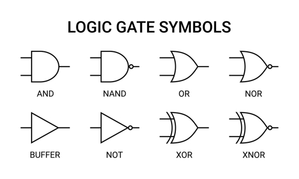
     
Schematic Symbols for Logic Gates

     

     

     <ul>
     <li><strong>Technician habit:</strong> Compare measured output to the truth table one row at a time.</li>
     <li><strong>Common mistake:</strong> Testing only one input state and declaring the gate good.</li>
     <li><strong>Sanity Check:</strong> For an AND gate, any input LOW should force output LOW.</li>
     </ul>
     
<strong>Question Hook:</strong> Which truth table row proves that an AND gate is not the same as an OR gate?

    </section>
    
    <!-- Slide 4: Floating Pins -->
    <section id="floating">
    <h2>Floating Pins &amp; Pull-ups</h2>
     
In digital electronics, an unconnected pin is Floating - it is not 1 or 0, it is garbage.

     

     

     
<strong>Pull-up Resistor:</strong> A resistor connected to VCC that ensures a pin stays HIGH when the switch is open.

     
<strong>Pull-down Resistor:</strong> A resistor connected to GND that ensures a pin stays LOW when the switch is open.

     

     

     <ul>
     <li><strong>Misconception:</strong> "Not connected" does not mean LOW.</li>
     <li><strong>Application:</strong> Buttons on microcontrollers use pull-ups or pull-downs to avoid random presses.</li>
     <li><strong>Rule of Thumb:</strong> Every digital input needs a defined state.</li>
     </ul>
     

     

     
Talking Point: Without pull resistors, static electricity and nearby signals can trigger digital circuits randomly.

     
<strong>Question Hook:</strong> What would a floating input look like on an LED output: steady, off, or random?

    </section>
    
    <!-- Slide 5: New Slide - Debugging Digital Inputs -->
    <section id="debug">
    <h2>Debugging Digital Inputs</h2>
     

     

     
<strong>Debug order:</strong>

     <ol>
     <li>Verify chip power: VCC and GND.</li>
     <li>Verify input state: is it truly HIGH or LOW?</li>
     <li>Verify pull resistor path.</li>
     <li>Compare output to the truth table.</li>
     </ol>
     

     

     
<strong>Mini-Demo:</strong> Remove one pull-down resistor and watch the output become unstable. Then reconnect it and retest.

     
<strong>Real-world example:</strong> A loose keypad line can make a device think buttons are being pressed.

     
<strong>Sanity Check:</strong> A valid logic HIGH must meet the chip's voltage threshold, not just "some voltage."

     

     

     
<strong>Question Hook:</strong> If the input is floating, can the gate itself still be perfectly good?

    </section>
    
    <!-- Slide 6: Lab Activity -->
    <section id="lab">
    <h2>Lab 7: Logic Observation</h2>
     

     

     
<strong>OBJECTIVE:</strong> Verify an AND gate using the 74HC08 Integrated Circuit.

     <ol>
     <li>Power the IC (Pin 14 to 5V, Pin 7 to GND).</li>
     <li>Connect two switches to Pins 1 and 2 (Inputs).</li>
     <li>Connect an LED to Pin 3 (Output).</li>
     <li>Ensure you use 10k Pull-down resistors on the switches.</li>
     <li>Fill out the truth table from actual measurements.</li>
     </ol>
     

     

     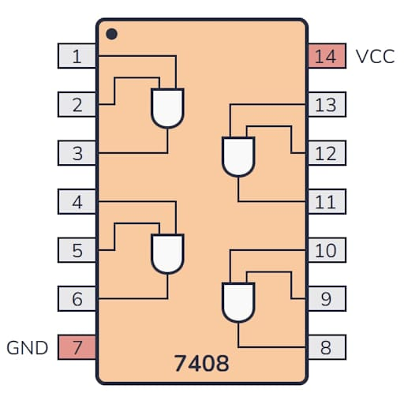
     
Quad 2-Input AND Gate IC

     

     

     
<strong>Question Hook:</strong> If the LED never turns on, should you check the truth table first or the IC power pins first?

    </section>
    
    <!-- Slide 7: Recap -->
    <section id="recap">
    <h1>Wrap Up</h1>
     <h2>Day 7 Recap</h2>
     

     <ul>
     <li><strong>Digital:</strong> Binary states (High vs. Low) replace the sliding scale of analog.</li>
     <li><strong>Logic Gates:</strong> The hardware that makes decisions.</li>
     <li><strong>Truth Tables:</strong> The cheat sheet for how a gate behaves.</li>
     <li><strong>Pull-ups/downs:</strong> Crucial for keeping digital inputs stable.</li>
     <li><strong>Debugging:</strong> Power, inputs, pulls, output - in that order.</li>
     </ul>
     

     
<strong>Exit Question:</strong> Why is a floating input more dangerous than a LOW input?

     
<strong>Tomorrow:</strong> Soldering Theory - Making your circuits permanent and professional.

    </section>
    
     <footer>
     
     
&copy; 2026 Mississippi Coding Academy / NEXTHANDS

     </footer>
    </body>
    </html>

- filePath: day8.html
  action: "modify"
  content: |
    <!DOCTYPE html>
    <html lang="en">
    <head>
     <meta charset="UTF-8">
     <meta name="viewport" content="width=device-width, initial-scale=1.0">
     <title>Day 8: Soldering & Rework</title>
     
    </head>
    <body>
    

     
     
     
     
     
     
     
    

    
    <!-- Slide 1: Welcome -->
    <section id="intro">
    <h1>Day 8</h1>
     <h2>Soldering: The Permanent Connection</h2>
     
Soldering is the process of joining two metals using a filler material (Solder) to create a mechanical and electrical bond.

     <ul>
     <li><strong>Thermal Mass:</strong> The ability of a component to hold heat.</li>
     <li><strong>Wetting:</strong> When molten solder flows smoothly over a surface.</li>
     <li><strong>Flux:</strong> A chemical agent that removes oxidation so solder can stick.</li>
     <li><strong>Repair view:</strong> A beautiful circuit design can still fail from one cold joint.</li>
     </ul>
     
<strong>Real-world example:</strong> Intermittent devices often fail when bumped because a cracked solder joint opens and closes with movement.

     
Pro Tip: You are not "gluing" parts; you are creating a metallurgical bond.

     
<strong>Question Hook:</strong> Why does solder need clean metal instead of just heat?

    </section>
    
    <!-- Slide 2: Solder Station -->
    <section id="station">
    <h2>The Solder Station</h2>
     

     

     <h3 style="font-size: 2rem; color: var(--accent);">The Iron</h3>
     
Heats the joint. Standard electronics work happens between 300&deg;C and 350&deg;C.

     <h3 style="font-size: 2rem; color: var(--accent);">The Solder</h3>
     
Usually a Lead-Free (Sn/Cu) or Leaded (Sn/Pb) wire with a Rosin Core (Flux).

     

     

     
<strong>Cleaning Tools:</strong>

     <ul>
     <li>Brass Wool (Best for tip life)</li>
     <li>Damp Sponge (Classic)</li>
     <li>Tip Tanner (For oxidized tips)</li>
     <li>Fresh solder: helps re-tin a dry tip.</li>
     </ul>
     
<strong>Sanity Check:</strong> A dirty tip transfers heat poorly, so turning up temperature is often the wrong fix.

     

     

     
<strong>Question Hook:</strong> Why can a hotter iron sometimes cause worse joints?

    </section>
    
    <!-- Slide 3: Perfect Joint -->
    <section id="joint">
    <h2>Anatomy of a Perfect Joint</h2>
     
<strong>The 3-Second Rule:</strong>

     

     

     <ol>
     <li><strong>Heat:</strong> Touch iron to the pad AND the lead simultaneously.</li>
     <li><strong>Feed:</strong> Touch solder to the joint, not the iron tip.</li>
     <li><strong>Retract:</strong> Remove solder, then remove the iron.</li>
     </ol>
     
A good joint is Shiny and Concave, like a tiny cone.

     <ul>
     <li><strong>Cold joint:</strong> Dull, lumpy, or cracked.</li>
     <li><strong>Bridge:</strong> Solder accidentally connects two pads.</li>
     <li><strong>Insufficient wetting:</strong> Solder beads up instead of flowing.</li>
     </ul>
     

     

     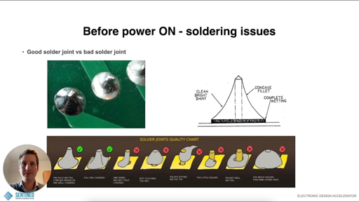
     
Left: Ideal Joint | Right: Cold Joint (Bad)

     

     

     
<strong>Question Hook:</strong> What visual clue tells you solder flowed onto both the pad and the component lead?

    </section>
    
    <!-- Slide 4: Desoldering -->
    <section id="rework">
    <h2>Fixing Mistakes: Desoldering</h2>
     
CAUTION: Repeatedly heating a pad can cause it to lift off the board. Work quickly.

     

     

     
<strong>Tools for the Undo Button:</strong>

     <ul>
     <li><strong>Solder Sucker:</strong> A vacuum pump that gulps molten solder.</li>
     <li><strong>Solder Wick:</strong> Braided copper that soaks up solder via capillary action.</li>
     <li><strong>Flux:</strong> Helps old solder flow again.</li>
     <li><strong>Fresh solder:</strong> Adds flux and improves heat transfer.</li>
     </ul>
     

     

     
<strong>Practical implication:</strong> Rework is a controlled rescue operation. The goal is to remove the part without damaging pads or traces.

     
<strong>Sanity Check:</strong> If a joint will not melt, add a tiny amount of fresh solder before using more force.

     
<strong>Soldering Pun:</strong> The best joints are made with good connections - electrically and professionally.

     

     

     
Pro Tip: If a joint will not melt, add a little fresh solder. The new flux will help the heat flow.

    </section>
    
    <!-- Slide 5: New Slide - Inspection Checklist -->
    <section id="inspection">
    <h2>Inspection Checklist</h2>
     

     

     
<strong>Look for:</strong>

     <ul>
     <li>Shiny, smooth fillet around the lead.</li>
     <li>No bridges between neighboring pads.</li>
     <li>No lifted pads or overheated board material.</li>
     <li>Lead trimmed short but not flush with the joint.</li>
     </ul>
     

     

     
<strong>Mini-Demo:</strong> Show one good joint, one cold joint, and one bridge. Students identify the failure before the instructor explains it.

     
<strong>Real-world example:</strong> Quality control often uses visual inspection plus continuity testing before powering a board.

     
<strong>Rule of Thumb:</strong> Inspect with your eyes first, then verify with the meter.

     

     

     
<strong>Question Hook:</strong> Which solder defect is more likely to create a short: cold joint or bridge?

    </section>
    
    <!-- Slide 6: Lab Activity -->
    <section id="lab">
    <h2>Lab 8: Through-Hole Soldering</h2>
     

     

     
<strong>OBJECTIVE:</strong> Assemble a practice PCB and perform component rework.

     <ol>
     <li>Solder a 10-resistor Ladder on a perf-board.</li>
     <li>Inspect for Bridges (accidental connections).</li>
     <li>Use Solder Wick to remove one resistor without damaging the pad.</li>
     <li>Final check: Use DMM Continuity mode to verify connections.</li>
     <li>Photograph one best joint and one reworked joint for the notebook.</li>
     </ol>
     

     

     
SAFETY: Fumes are toxic. Turn on the desk fans and never touch the metal barrel of the iron.

     
<strong>Common mistakes:</strong> feeding solder to the iron tip, moving the joint while cooling, and overheating the pad.

     

     

     
<strong>Question Hook:</strong> Why should the joint stay still while the solder cools?

    </section>
    
    <!-- Slide 7: Recap -->
    <section id="recap">
    <h1>Wrap Up</h1>
     <h2>Day 8 Recap</h2>
     

     <ul>
     <li><strong>The Bond:</strong> Solder flows toward the heat. Heat the work, not the solder.</li>
     <li><strong>Appearance:</strong> Shiny and smooth = Good. Dull and chunky = Cold/Weak.</li>
     <li><strong>Flux:</strong> Your best friend for clean, fast soldering.</li>
     <li><strong>Rework:</strong> Desoldering is just as important as soldering.</li>
     <li><strong>Inspection:</strong> Visual checks catch many failures before power is applied.</li>
     </ul>
     

     
<strong>Exit Question:</strong> What are two signs that a solder joint is cold?

     
<strong>Tomorrow:</strong> Systematic Troubleshooting - How to find the needle in the haystack.

    </section>
    
     <footer>
     
     
&copy; 2026 Mississippi Coding Academy / NEXTHANDS

     </footer>
    </body>
    </html>

- filePath: day9.html
  action: "modify"
  content: |
    <!DOCTYPE html>
    <html lang="en">
    <head>
     <meta charset="UTF-8">
     <meta name="viewport" content="width=device-width, initial-scale=1.0">
     <title>Day 9: Systematic Troubleshooting</title>
     
    </head>
    <body>
    

     
     
     
     
     
     
     
    

    
    <!-- Slide 1: Welcome -->
    <section id="intro">
    <h1>Day 9</h1>
     <h2>Systematic Troubleshooting</h2>
     
Repair is not guessing. It is a logical process of elimination.

     <h3 style="font-size: 2rem; color: var(--accent);">The Technician's Mantra:</h3>
     <ol>
     <li>Identify the Symptom</li>
     <li>Isolate the Stage</li>
     <li>Identify the Component</li>
     <li>Verify the Fix</li>
     </ol>
     <ul>
     <li><strong>Misconception:</strong> Replacing the most suspicious part first is not troubleshooting; it is gambling.</li>
     <li><strong>Real-world example:</strong> A repair shop loses money when techs replace good parts without proving failure.</li>
     </ul>
     
Pro Tip: "If you didn't measure it, you don't know it." Avoid assumptions at all costs.

     
<strong>Question Hook:</strong> What evidence would convince you that a fault is fixed, not just temporarily hidden?

    </section>
    
    <!-- Slide 2: Sensory Check -->
    <section id="sensory">
    <h2>Step 1: The Sensory Check</h2>
     
Before grabbing the DMM, use your eyes, nose, and ears.

     

     

     <ul>
     <li><strong>Look:</strong> Leaky capacitors, burnt resistors, or cracked solder joints.</li>
     <li><strong>Smell:</strong> The ozone scent of Magic Smoke or fried silicon.</li>
     <li><strong>Touch:</strong> Gently check for components that are running too hot, carefully.</li>
     <li><strong>Listen:</strong> Buzzing, clicking, or arcing can point to power problems.</li>
     </ul>
     
<strong>Sanity Check:</strong> If a part is visibly burnt, still ask what caused it to burn.

     

     

     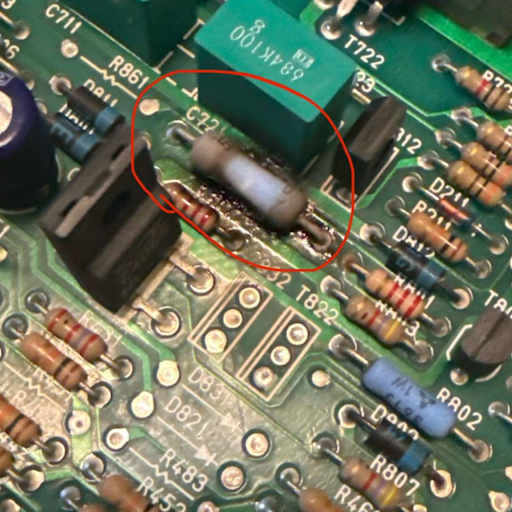
     
Obvious Visual Fault: Overheated Resistor

     

     

     
<strong>Question Hook:</strong> Why should a burnt resistor make you suspect another fault upstream or downstream?

    </section>
    
    <!-- Slide 3: Divide and Conquer -->
    <section id="divide">
    <h2>Divide and Conquer</h2>
     
Do not test every part. Break the circuit into functional blocks.

     

     

     <h3 style="font-size: 2rem; color: var(--accent);">Input Stage</h3>
     
Is the power getting in? Check the fuse and the battery/jack.

     <h3 style="font-size: 2rem; color: var(--accent);">Processing Stage</h3>
     
Are the transistors switching? Is the logic chip receiving a signal?

     <h3 style="font-size: 2rem; color: var(--accent);">Output Stage</h3>
     
Is the LED, motor, or speaker actually connected to the ground?

     

     

     
<strong>Method:</strong> Test the middle. If signal is good in the middle, the fault is in the second half.

     <ul>
     <li><strong>Practical implication:</strong> Block-level testing saves time on complex boards.</li>
     <li><strong>Sanity Check:</strong> Always prove power and ground before testing signal behavior.</li>
     <li><strong>Troubleshooting Motto:</strong> Do not hunt ghosts; follow volts.</li>
     </ul>
     

     

     
<strong>Question Hook:</strong> Where would you measure first on a dead board: input, middle, or output?

    </section>
    
    <!-- Slide 4: Reliability Killers -->
    <section id="killers">
    <h2>Top 3 Reliability Killers</h2>
     

     

     <h3 style="font-size: 2rem; color: var(--accent);">1. Cold Solder Joints</h3>
     
A joint that looks frosty or cracked. It makes intermittent contact.

     <h3 style="font-size: 2rem; color: var(--accent);">2. Electrolytic Caps</h3>
     
They dry out or bulge over time. The leading cause of power supply failure.

     <h3 style="font-size: 2rem; color: var(--accent);">3. Blown Diodes</h3>
     
Usually caused by plugging in the wrong polarity power adapter.

     

     

     <ul>
     <li><strong>Misconception:</strong> Intermittent faults are not random; they are often mechanical, thermal, or connection-related.</li>
     <li><strong>Application:</strong> Tapping or gently flexing a board can reveal cracked joints, but do it carefully.</li>
     <li><strong>Sanity Check:</strong> A replacement part should match value, polarity, rating, and package fit.</li>
     </ul>
     

     

     
<strong>Question Hook:</strong> Which killer is most likely to fail only after the device warms up?

    </section>
    
    <!-- Slide 5: New Slide - Fault Tree -->
    <section id="fault-tree">
    <h2>Fault Tree &amp; Evidence Log</h2>
     

     

     
<strong>Build a simple fault tree:</strong>

     <ol>
     <li>Symptom: What exactly fails?</li>
     <li>Possible stages: input, processing, output.</li>
     <li>Tests: What reading would prove each stage good?</li>
     <li>Conclusion: Which evidence points to the failed part?</li>
     </ol>
     

     

     
<strong>Mini-Demo:</strong> Instructor gives one symptom. Students list three possible causes and one measurement to eliminate each.

     
<strong>Real-world example:</strong> A no-power device might be a dead battery, blown fuse, open switch, bad regulator, or shorted load. The evidence log separates them.

     
<strong>Rule of Thumb:</strong> Every conclusion should have a measurement beside it.

     

     

     
<strong>Question Hook:</strong> What measurement would eliminate the power-input stage as the problem?

    </section>
    
    <!-- Slide 6: Lab Activity -->
    <section id="lab">
    <h2>Lab 9: Finding the "Planted" Fault</h2>
     

     

     
<strong>OBJECTIVE:</strong> Diagnose a broken circuit provided by the instructor.

     <ol>
     <li>Power up the board and document the symptom.</li>
     <li>Trace the voltage from the input using your DMM.</li>
     <li>Identify if the fault is an Open (broken path) or a Short (accidental path).</li>
     <li>Mark the component for replacement.</li>
     <li>Verify the fix by repeating the original failed test.</li>
     </ol>
     

     

     
<strong>Technician Tip:</strong> Use the Beep (Continuity) mode to find invisible cracks in copper traces.

     
<strong>Common mistakes:</strong> testing continuity on a powered board, replacing parts without notes, and forgetting to retest the symptom.

     
<strong>Sanity Check:</strong> A fixed board must pass the same test that originally failed.

     

     

     
<strong>Question Hook:</strong> If a repair "works" but you cannot explain why, is the troubleshooting complete?

    </section>
    
    <!-- Slide 7: Recap -->
    <section id="recap">
    <h1>Wrap Up</h1>
     <h2>Day 9 Recap</h2>
     

     <ul>
     <li><strong>Logic First:</strong> Troubleshooting is a mental game before it is a physical one.</li>
     <li><strong>Visuals:</strong> Many faults can be found just by looking closely.</li>
     <li><strong>Isolation:</strong> Do not test the whole board; narrow it down to a single stage.</li>
     <li><strong>The DMM:</strong> Use DC Volts to check for power, and Continuity to check for paths.</li>
     <li><strong>Evidence:</strong> A repair is complete only when the original symptom is verified as fixed.</li>
     </ul>
     

     
<strong>Exit Question:</strong> What is one measurement that proves a circuit stage is good?

     
<strong>Tomorrow:</strong> THE CAPSTONE. No more hints - just you and the broken device.

    </section>
    
     <footer>
     
     
&copy; 2026 Mississippi Coding Academy / NEXTHANDS

     </footer>
    </body>
    </html>

- filePath: day10.html
  action: "modify"
  content: |
    <!DOCTYPE html>
    <html lang="en">
    <head>
     <meta charset="UTF-8">
     <meta name="viewport" content="width=device-width, initial-scale=1.0">
     <title>Day 10: Final Capstone & Certification</title>
     
    </head>
    <body>
    

     
     
     
     
     
     
    

    
    <!-- Slide 1: Welcome -->
    <section id="intro">
    <h1>DAY 10</h1>
     <h2>Capstone Integration Day</h2>
     
"The expert in anything was once a beginner."

     
Today, you transition from student to technician. You will be given a non-functional device and a blank repair ticket. Your job is to bring it back to life.

     <ul>
     <li><strong>Mindset:</strong> Work the process, not the panic.</li>
     <li><strong>Evidence:</strong> Every replacement must be backed by a measurement or observation.</li>
     <li><strong>Professionalism:</strong> A neat bench and clear notes are part of the repair.</li>
     </ul>
     
<strong>Question Hook:</strong> What is the first thing you should do when handed a broken device?

    </section>
    
    <!-- Slide 2: Practical Exam -->
    <section id="exam">
    <h2>The Practical Exam</h2>
     
You will be graded on your process, not just the result. We are looking for:

     

     

     <h3 style="font-size: 2rem; color: var(--accent);">Safety</h3>
     
PPE, ESD precautions, and station tidiness.

     <h3 style="font-size: 2rem; color: var(--accent);">Diagnostics</h3>
     
Logical use of the DMM and circuit tracing.

     <h3 style="font-size: 2rem; color: var(--accent);">Execution</h3>
     
Clean soldering and professional rework.

     

     

     
<strong>Reminder:</strong> Document every voltage reading. If the instructor asks "Why did you replace this?", you need data to back it up.

     <ul>
     <li><strong>Misconception:</strong> Getting lucky is not the same as demonstrating repair skill.</li>
     <li><strong>Sanity Check:</strong> If you cannot explain your measurement path, slow down and redraw the circuit blocks.</li>
     </ul>
     

     

     
<strong>Question Hook:</strong> Which matters more in a practical exam: replacing the part quickly or proving why it failed?

    </section>
    
    <!-- Slide 3: New Slide - Repair Ticket Walkthrough -->
    <section id="ticket">
    <h2>Repair Ticket Walkthrough</h2>
     

     

     
<strong>Your ticket should include:</strong>

     <ol>
     <li>Initial symptom in one clear sentence.</li>
     <li>Safety checks completed.</li>
     <li>Measurements with probe locations.</li>
     <li>Fault isolated to stage and component.</li>
     <li>Repair action and final verification.</li>
     </ol>
     

     

     
<strong>Mini-Example:</strong> "No LED output. 9.1V at battery, 0V after switch. Continuity failed across switch. Replaced switch. LED output restored."

     
<strong>Rule of Thumb:</strong> A stranger should be able to read your ticket and understand why the repair was correct.

     
<strong>Capstone Joke:</strong> Keep the magic smoke inside; it is not part of the presentation.

     

     

     
<strong>Question Hook:</strong> What detail is missing from the phrase "replaced bad part"?

    </section>
    
    <!-- Slide 4: Capstone Presentation -->
    <section id="presentation">
    <h2>Capstone Presentation</h2>
     
Once the repair is verified, you will briefly explain your journey to the class:

     <ul>
     <li><strong>Initial Symptom:</strong> What was the device doing or not doing?</li>
     <li><strong>The Breakthrough:</strong> What measurement or visual cue led you to the fault?</li>
     <li><strong>The Fix:</strong> What component was replaced and how did you verify success?</li>
     <li><strong>Lesson Learned:</strong> What would you check faster next time?</li>
     </ul>
     
<strong>FINAL TASK:</strong> Perform a Final Test in front of the instructor to confirm the device meets original specifications.

     
<strong>Real-world example:</strong> Service technicians often explain repairs to customers or supervisors, so clear communication is part of the job.

     
<strong>Question Hook:</strong> What measurement is your strongest proof that the device is actually fixed?

    </section>
    
    <!-- Slide 5: Beyond ELT 101 -->
    <section id="beyond">
    <h2>Beyond ELT 101</h2>
     
You now have the foundations. Where do you go from here?

     

     

     
<strong>Professional Paths:</strong>

     <ul>
     <li>Consumer Electronics Repair</li>
     <li>Industrial Maintenance (Mechatronics)</li>
     <li>Aviation/Automotive Avionics</li>
     <li>Quality Assurance Testing</li>
     </ul>
     

     

     
<strong>Next Hands Advice:</strong> Start building a portfolio. Save photos of your best solder joints and your completed Capstone project.

     <ul>
     <li>Keep a notebook of faults and fixes.</li>
     <li>Practice reading schematics in small sections.</li>
     <li>Build simple circuits until measurement becomes automatic.</li>
     </ul>
     

     

     
<strong>Question Hook:</strong> Which skill from this course would you put first on a technician resume?

    </section>
    
    <!-- Slide 6: Congratulations -->
    <section id="congrats">
    <h1>CONGRATULATIONS</h1>
     
You have completed theory and laboratory basic electronics repair training.

     <h2>ELT 101 Certified</h2>
     
"May your circuits always be closed and your magic smoke stay inside."

     

     <ul>
     <li><strong>You can build:</strong> basic DC, LED, series, parallel, RC, transistor, and logic circuits.</li>
     <li><strong>You can measure:</strong> voltage, resistance, continuity, diode behavior, and basic fault evidence.</li>
     <li><strong>You can repair:</strong> inspect, solder, rework, isolate, replace, and verify.</li>
     </ul>
     

     
<strong>Final Question:</strong> What is one electronics habit you will keep using after this course?

    </section>
    
     <footer>
     
     
&copy; 2026 Mississippi Coding Academy / NEXTHANDS

     </footer>
    </body>
    </html>

D) summary
- Day 1: Added stronger safety, Ohm's Law sanity checks, component misconceptions, DMM usage warnings, and a pre-power build checklist. Fun fact added on ESD.
- Day 2: Added current/heat risk, voltage/current behavior in series and parallel, power sharing, switch logic context, and branch troubleshooting. One light parallel-circuit joke added.
- Day 3: Added measurement documentation, power dissipation interpretation, OL clarification, half-split troubleshooting, and a measurement-notes slide. Meter joke added.
- Day 4: Added diode bias misconceptions, rectification ripple context, bridge rectifier diagnostics, and diode failure modes. One diode one-way-street joke added.
- Day 5: Added capacitor safety depth, RC estimation, inductor spike context, failed-cap inspection details, and an RC quick-estimate slide. Capacitor fade joke added.
- Day 6: Added saturation-vs-linear troubleshooting, datasheet gain caution, pinout failure symptoms, and base-resistor sizing. Transistor bouncer joke added.
- Day 7: Added logic-gate applications, truth-table testing discipline, floating-input misconceptions, and a digital-input debugging slide. Binary joke added.
- Day 8: Added tip maintenance, cold-joint and bridge diagnostics, rework cautions, and an inspection checklist. Brief soldering connection pun added.
- Day 9: Added evidence-based troubleshooting, sensory checks, block isolation, reliability-killer diagnostics, and a fault-tree/evidence-log slide. Troubleshooting motto added.
- Day 10: Added grading-process clarity, repair ticket structure, presentation prompts, career next steps, and final evidence-based wrap-up. Magic-smoke joke retained as capstone humor.
